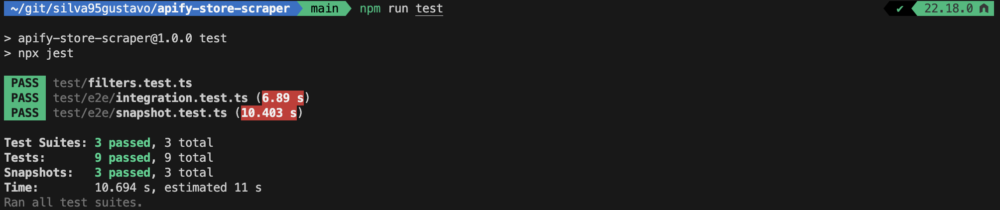
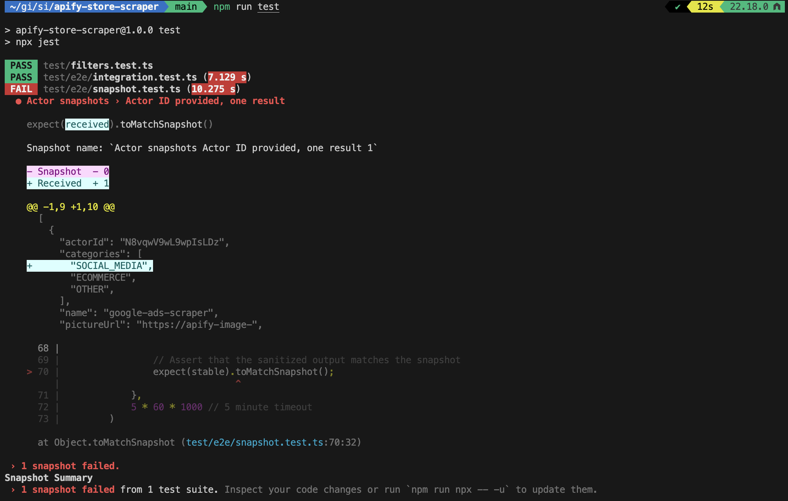
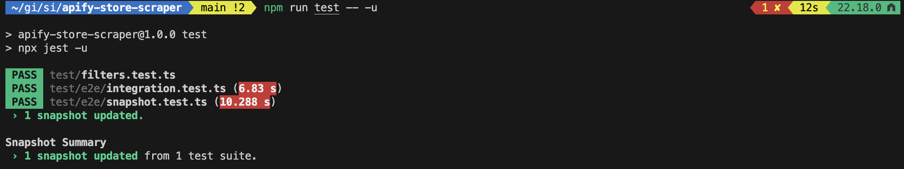

# How I test my Apify actors efficiently during development with Crawlee and JavaScript

When I started building scraping actors in Apify, my iteration cycle was brutal: make a change, run the actor, wait over a minute for HTTP responses, inspect output, repeat. A few weeks later, it was clear I needed a better testing strategy.

I built three Apify actors ([Google](https://apify.com/silva95gustavo/google-ads-scraper), [LinkedIn](https://apify.com/silva95gustavo/linkedin-ad-library-scraper), and [TikTok](https://apify.com/silva95gustavo/tiktok-ads-scraper) ad scrapers) and developed a testing approach using **local debugging**, **E2E testing**, and **unit testing**. It cut my iteration time dramatically and allowed me to catch many bugs before production. I'll walk through this using an [Apify store scraper](https://github.com/silva95gustavo/apify-store-scraper) as a simpler example.

**Full code:** The Apify Store Scraper used in this article is available on [GitHub](https://github.com/silva95gustavo/apify-store-scraper).



## E2E testing

End-to-end (E2E) testing means running my complete actor locally with real inputs, connecting to the remote server, so nothing is mocked or faked. E2E tests are particularly valuable for me to ensure reliability in production, as they simulate how my actors perform in the actual Apify environment and when interacting with real remote servers.

From my experience developing Apify actors, setting up E2E testing begins with a reliable way to run the actor locally with specific inputs, capture its output, and grab logs for debugging. Here's the helper function I've built and use in my actors:

```typescript
// Function to run the Apify actor locally with given input
// Returns the dataset items and logs from the run
export async function runActorWithInput(
    input: unknown
): Promise<{ datasetItems: DatasetItem[]; logs: string }> {
    // Create a temporary directory for local storage
    const tmpDir = mkdtempSync(path.join(os.tmpdir(), "actor-e2e-"));
    try {
        // Set up directories for key-value store and datasets
        const kvStoreDir = path.join(tmpDir, "key_value_stores", "default");
        const datasetsDir = path.join(tmpDir, "datasets", "default");

        await fs.mkdir(kvStoreDir, { recursive: true });
        await fs.mkdir(datasetsDir, { recursive: true });

        // Write the input to the key-value store as INPUT.json
        await fs.writeFile(
            path.join(kvStoreDir, "INPUT.json"),
            JSON.stringify(input, null, 2)
        );

        // Command to run the actor locally
        const processArgs = ["run"];

        // Environment variables for the actor run
        const env: NodeJS.ProcessEnv = {
            ...process.env,
            APIFY_LOCAL_STORAGE_DIR: tmpDir,
            APIFY_TOKEN: process.env.APIFY_API_TOKEN,
        };

        let logs = "";

        // Run the actor using 'apify run' and capture logs
        await new Promise<void>((resolve, reject) => {
            const child = spawn("apify", processArgs, {
                cwd: PROJECT_ROOT,
                env,
                stdio: ["ignore", "pipe", "pipe"],
            });

            child.stdout.on("data", (d: Buffer) => {
                logs += d.toString();
            });
            child.stderr.on("data", (d: Buffer) => {
                logs += d.toString();
            });
            child.on("error", reject);
            child.on("close", (code) => {
                if (code === 0) resolve();
                else
                    reject(
                        new Error(`Actor exited with code ${code}\n${logs}`)
                    );
            });
        });

        // Read the dataset items from the local storage
        const items: DatasetItem[] = [];
        if (existsSync(datasetsDir)) {
            const files = await fs.readdir(datasetsDir);
            const jsonFiles = files.filter((f) => f.endsWith(".json"));
            for (const f of jsonFiles) {
                const raw = await fs.readFile(
                    path.join(datasetsDir, f),
                    "utf-8"
                );
                items.push(JSON.parse(raw));
            }
        }
        return { datasetItems: items, logs };
    } finally {
        // Clean up temporary directory
        rmSync(tmpDir, { recursive: true, force: true });
    }
}
```

This function sets up a temporary local storage directory, writes the input to `INPUT.json`, runs the actor with `apify run`, captures the output dataset items, and cleans up afterward. It also collects logs for debugging purposes.

I use `spawn` to run the actor in a completely isolated process. This ensures that environment variables (like the local storage directory) are fresh for every test and don't leak between runs.

With this helper in place, I can write integration tests that verify specific behaviors without relying on snapshots. Here are two examples for our Apify Store scraper:

```typescript
describe("Integration tests", () => {
    test(
        "Limit respected in results",
        async () => {
            // Search for actors in Apify by the query "google ads".
            const { datasetItems } = await runActorWithInput({
                query: "google ads",
                limit: 4,
            });

            // Ensure the number of results matches the input config.
            expect(datasetItems.length).toBe(4);
        },
        60 * 1000
    );

    test(
        "Query text is respected",
        async () => {
            const { datasetItems } = await runActorWithInput({
                query: "linkedin ads",
                limit: 1,
            });

            // Check that the title contains "linkedin" (case insensitive).
            // We don't assert exact match to allow for variations in titles and changes to ranking of results.
            expect(datasetItems[0].title.toLowerCase()).toContain("linkedin");
        },
        60 * 1000
    );
});
```

These tests focus on validating key functionalities: the first ensures the `limit` parameter controls the number of results, and the second checks that the `query` parameter filters results appropriately. These are explicit assertions that are easy to understand and maintain.

### Snapshot testing with Jest

Another strategy that has been working really well for me when E2E testing my actors is using snapshots.

[Snapshot testing](https://jestjs.io/docs/snapshot-testing) allows me to **capture the output of my actor at a given state** and automatically compare future runs against it. Any unexpected changes are flagged immediately. I can easily test complex structures without writing much code, receive good warnings when something changes, and update tests with ease by just running a command.

With Apify actors, I find it easy to select a few input combinations that cover most logic paths, automatically generate their snapshots, and then be much more confident that future changes won't affect the output in unintended ways because the snapshots would break in unexpected places.

Before we look at the actual snapshot tests, let me share a helper function I use to sanitize the actor's output data. This is essential for creating stable snapshots that focus on the data we care about, avoiding false positives from dynamic fields.

In my experience, raw actor outputs often include dynamic data like timestamps, full URLs, or varying IDs that can cause snapshots to fail unnecessarily on every run. Before we look at the actual snapshot tests, let me share a helper function I use to sanitize the actor's output data. This is essential for creating stable snapshots that focus on the data we care about, avoiding false positives from dynamic fields.

Here's how I do it for the Apify Store scraper:

```typescript
// Interface for sanitized dataset items to ensure stable snapshots
interface StableDatasetItem {
    actorId: string;
    categories: string[];
    name: string;
    pictureUrl: string;
    title: string;
    userFullName: string;
    username: string;
}

// Function to sanitize dataset items for snapshot stability
// Removes dynamic parts and sorts for consistent comparisons
function sanitizeItems(items: DatasetItem[]): StableDatasetItem[] {
    const stable = items
        .map((it) => ({
            actorId: it.actorId,
            categories: it.categories,
            name: it.name,
            pictureUrl: it.pictureUrl.slice(0, 20), // Truncate to first few chars
            title: it.title,
            userFullName: it.userFullName,
            username: it.username,
        }))
        .sort((a, b) => a.actorId.localeCompare(b.actorId));

    return stable;
}
```

By truncating the `pictureUrl` to the first 20 characters (since the full URL might vary) and sorting by `actorId` for consistent ordering, I ensure the snapshots are stable and only reflect changes in the core data I'm testing. This way, snapshots catch real regressions without being triggered by noise.

Now, let's see how I put it all together in the actual snapshot tests. I define a set of test cases with different inputs to cover various scenarios, run the actor, sanitize the output, and compare against snapshots:

```typescript
const testCases: { description: string; input: Input }[] = [
    {
        description: "Actor ID provided, one result",
        input: {
            actorId: "N8vqwV9wL9wpIsLDz",
        },
    },
    {
        description: "Actor ID, query and username provided, one result",
        input: {
            actorId: "N8vqwV9wL9wpIsLDz",
            query: "google ads",
            username: "silva95gustavo",
        },
    },
    {
        description: "Query with zero matches",
        input: {
            query: crypto.randomBytes(32).toString("hex"),
        },
    },
];

// Test suite for snapshot testing the actor with different inputs
describe("Actor snapshots", () => {
    testCases.forEach((testCase) =>
        test(
            testCase.description,
            async () => {
                // Run the actor and get results
                const { datasetItems } = await runActorWithInput(
                    testCase.input
                );
                const stable = sanitizeItems(datasetItems);

                // Assert that the sanitized output matches the snapshot
                expect(stable).toMatchSnapshot();
            },
            60 * 1000
        )
    );
});
```

These tests run the actor with specific inputs, sanitize the results, and check that the output matches the expected snapshot. If anything changes unexpectedly, the snapshot will fail, alerting me to potential issues.



In my workflow, I run the tests with `npm run test`, which in turn runs `npx jest`. Whenever the snapshots break, I check the diff to understand what broke. If the changes are intended, I update them by simply running `npm run test -- -u`.



#### Pitfalls to watch out for in snapshot testing

I learned these lessons the hard way:

-   **Don't create massive snapshots**: My first snapshots were too big. Updating them became tedious, and I stopped trusting them. Keep snapshots focused on one thing.
-   **Test clarity issues**: Snapshots can sometimes obscure what's actually being tested. I would occasionally find myself not remembering the purpose of tests I had written a few weeks earlier. Just reading the test might not make it clear what specific behavior is the target of the test, so I started making sure to explain the purpose of each test in its description or even as a comment.
-   **Update traps**: It's tempting to update snapshots without reviewing the diff. Don't. Read what changed before accepting it.

### Unit testing

**Unit tests** let me test critical pieces in isolation. For the store scraper, the Apify marketplace uses Algolia search, which requires very specific filter formatting. I learned this by making mistakes—forgetting to escape special characters, misunderstanding the AND operator. Here's the function that handles this:

```typescript
import { Input } from "./types";

export function buildFilters(input: Pick<Input, "actorId" | "username">) {
    const filters: string[] = [];

    if (input.actorId) {
        filters.push(`objectID:${JSON.stringify(input.actorId)}`);
    }

    if (input.username) {
        filters.push(`username:${JSON.stringify(input.username)}`);
    }

    return filters.join(" AND ");
}
```

This function takes an actor ID or username and builds a filter string like `objectID:"N8vqwV9wL9wpIsLDz" AND username:"silva95gustavo"`, which Algolia uses to narrow down search results. Testing this logic in isolation ensures filters are constructed correctly without having to run the full scraper.

Here are some unit tests for this function:

```typescript
describe("buildFilters", () => {
    test("returns empty string when no filters are provided", () => {
        const result = buildFilters({});
        expect(result).toBe("");
    });

    test("builds filter for actorId only", () => {
        const result = buildFilters({ actorId: "N8vqwV9wL9wpIsLDz" });
        expect(result).toBe('objectID:"N8vqwV9wL9wpIsLDz"');
    });

    test("builds filter for username only", () => {
        const result = buildFilters({ username: "silva95gustavo" });
        expect(result).toBe('username:"silva95gustavo"');
    });

    test("builds combined filter for both actorId and username", () => {
        const result = buildFilters({
            actorId: "N8vqwV9wL9wpIsLDz",
            username: "silva95gustavo",
        });
        expect(result).toBe(
            'objectID:"N8vqwV9wL9wpIsLDz" AND username:"silva95gustavo"'
        );
    });

    test("handles special characters in actorId", () => {
        const result = buildFilters({ actorId: 'test"with"quotes' });
        expect(result).toBe('objectID:"test\\"with\\"quotes"');
    });

    test("handles special characters in username", () => {
        const result = buildFilters({ username: 'user"name' });
        expect(result).toBe('username:"user\\"name"');
    });
});
```

Unit tests complement other forms of testing by **isolating critical functions**, making it easier to pinpoint failures without running the full actor.

### Local development with breakpoints

During development, I often run actors locally in debug mode with breakpoints.

To do this, I run `apify run` - this command populates a few environment variables under the hood and then calls the `start` script in your `package.json` file. In order for the debugger to attach to your Node process you can update the `start` script as follows:

```bash
# Before:
tsx src/main.ts

# After:
node --inspect --import tsx src/main.ts
```

Now I can set breakpoints and pause execution to inspect variables. Way faster than debugging with log messages.


### Additional tips

-   Setup your CI pipeline to automatically run your full test suite before deployment (including E2E tests).
-   Consider writing integration tests that mock the response of the remote server for quick testing of request handler logic.
-   Consider [automating scheduled tests](https://docs.apify.com/platform/actors/development/automated-tests) for your live actor.

### Summary

Three practices changed how I work:

-   **E2E testing** catches integration issues before production.
-   **Unit testing** protects critical logic with fast and focused tests.
-   **Local debugging** with breakpoints catches bugs fast.

This approach cut my iteration time significantly and prevented dozens of production bugs. If I started over, I'd build these tests from day one instead of after problems forced my hand.
